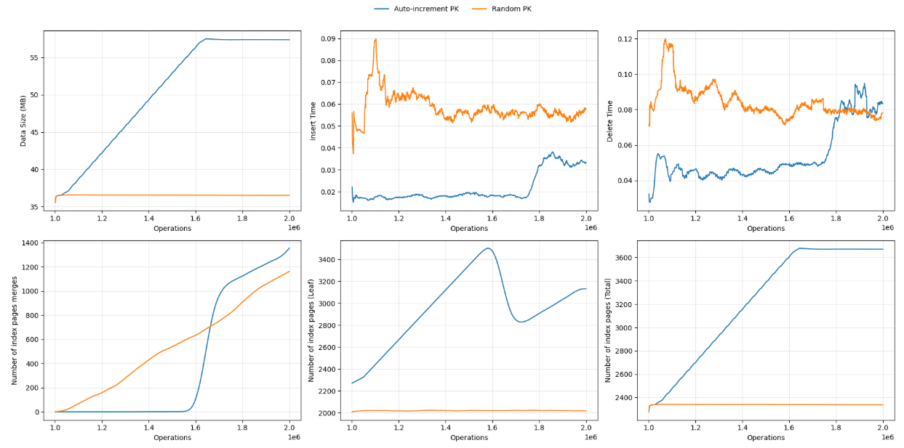

# MySQL Primary Key Benchmark

A Python project to benchmark the performance differences between sequential and UUID primary keys in MySQL InnoDB tables under concurrent insert/delete workloads.

## Overview

This project measures and compares:
- Sequential auto-increment primary keys
- UUID/random primary keys

The benchmark performs continuous insert and delete operations while tracking:
- Operation times
- B-tree page splits and merges
- Buffer pool statistics
- Disk I/O metrics
- Index statistics

## Project Structure

<<<<<<< HEAD
Most MySQL guidance recommends using `AUTO_INCREMENT` primary keys because:

- Inserts are append-only
- Page splits are minimized
- Insert performance is excellent during growth

However, real production systems often:
- Run continuously for months or years
- Perform frequent inserts *and* deletes
- Stabilize in total row count
- Care about **predictability, disk usage, and background maintenance cost**

This study explores what happens **after the initial growth phase**, when the system starts churning data rather than growing indefinitely.

---

## High-Level Experiment Design

Two identical InnoDB tables are used:

| Table Name | Primary Key Type |
|-----------|------------------|
| `seq_pk7` | `BIGINT AUTO_INCREMENT` |
| `uuid_pk7` | Random `BIGINT` |

Both tables:
- Use the same schema
- Store identical payload sizes
- Receive identical workloads

---

## Workload Characteristics

Each iteration performs:

1. Batch inserts
2. Batch deletes
3. Metric collection

This loop runs continuously to allow the system to:
- Grow initially
- Reach steady-state
- Exhibit long-term structural behavior

Deletes are intentional and essential — without deletes, steady-state behavior cannot be observed.

---

## Metrics Collected

Metrics are collected directly from MySQL and written to CSV for offline analysis.

### 1. Data Size
- Table size in MB from `information_schema.tables`
- Used to track disk usage over time

### 2. Insert Time
- Wall-clock latency for batch inserts
- Captures both foreground work and background contention

### 3. Delete Time
- Wall-clock latency for batch deletes
- Sensitive to index maintenance and merges

### 4. Index Page Merges
- Derived from `information_schema.innodb_metrics`
- Indicates background B-tree cleanup activity
- Important in steady-state workloads

### 5. Leaf Index Pages
- Number of leaf pages in the primary index
- Proxy for how data is laid out in the B-tree

### 6. Total Index Pages
- Includes both internal and leaf pages
- Indicates overall index footprint and memory pressure

> ⚠️ Page split metrics are intentionally excluded from conclusions while their accuracy is being validated.

---

## Why Index Page Merges Matter

Page merges occur after deletes when adjacent pages can be compacted.

They:
- Move records between pages
- Update parent nodes
- Consume CPU and buffer pool bandwidth

In long-running systems, **merge activity can dominate background cost**, even if insert rates remain constant.

---

## Key Observations

From the collected data:

- `AUTO_INCREMENT` performs best during the **initial growth phase**
- Random primary keys fragment early but **stabilize**
- Disk usage for random keys can become **smaller in steady-state**
- `AUTO_INCREMENT` tables show **significantly higher merge activity** over time
- Insert and delete latencies converge as the system matures

The results suggest that **primary key choice is phase-dependent**, not universally optimal.



---

## Repository Structure
=======
```
>>>>>>> 09a34ab (cleaning code)
.
├── main.py            # Entry point and CLI
├── config.py          # Configuration classes
├── database.py        # Database connection management
├── initializer.py     # Data initialization
├── operations.py      # Insert/delete operations
├── stats.py          # Statistics collection
├── logger.py         # CSV logging
├── benchmark.py      # Main benchmark runner
├── data_generator.py # Random data generation
└── README.md         # This file
```

## Requirements

- Python 3.7+
- MySQL 8.0+
- `mysql-connector-python`

Install dependencies:
```bash
pip install mysql-connector-python
```

## Database Setup

Before running, create the required tables in MySQL:

```sql
-- Sequential PK table
CREATE TABLE seq_pk7 (
    id BIGINT AUTO_INCREMENT PRIMARY KEY,
    payload VARCHAR(2)
) ENGINE=InnoDB;

-- UUID/Random PK table
CREATE TABLE uuid_pk7 (
    id BIGINT PRIMARY KEY,
    payload VARCHAR(2)
) ENGINE=InnoDB;

-- Stored procedures for batch operations
DELIMITER $$

CREATE PROCEDURE insert_rows_json2(
    IN table_name VARCHAR(255),
    IN json_data JSON
)
BEGIN
    DECLARE i INT DEFAULT 0;
    DECLARE n INT;
    DECLARE row_data JSON;
    
    SET n = JSON_LENGTH(json_data);
    
    WHILE i < n DO
        SET row_data = JSON_EXTRACT(json_data, CONCAT('$[', i, ']'));
        SET @sql = CONCAT('INSERT INTO ', table_name, ' (id, payload) VALUES (?, ?)');
        SET @id = JSON_UNQUOTE(JSON_EXTRACT(row_data, '$.id'));
        SET @payload = JSON_UNQUOTE(JSON_EXTRACT(row_data, '$.p'));
        
        PREPARE stmt FROM @sql;
        EXECUTE stmt USING @id, @payload;
        DEALLOCATE PREPARE stmt;
        
        SET i = i + 1;
    END WHILE;
END$$

CREATE PROCEDURE delete_by_ids_json(
    IN table_name VARCHAR(255),
    IN json_ids JSON
)
BEGIN
    DECLARE i INT DEFAULT 0;
    DECLARE n INT;
    DECLARE id_val BIGINT;
    
    SET n = JSON_LENGTH(json_ids);
    
    WHILE i < n DO
        SET id_val = JSON_EXTRACT(json_ids, CONCAT('$[', i, ']'));
        SET @sql = CONCAT('DELETE FROM ', table_name, ' WHERE id = ?');
        
        PREPARE stmt FROM @sql;
        EXECUTE stmt USING id_val;
        DEALLOCATE PREPARE stmt;
        
        SET i = i + 1;
    END WHILE;
END$$

DELIMITER ;
```

## Usage

### Basic Usage

Run with default settings:
```bash
python main.py
```

### Custom Configuration

```bash
python main.py \
    --host localhost \
    --user myuser \
    --password mypassword \
    --database test \
    --total-records 1000000 \
    --batch-size 100000 \
    --operation-batch 1000 \
    --output results.csv
```

### Command Line Arguments

**Database Connection:**
- `--host`: Database host (default: localhost)
- `--user`: Database user (default: paras.mal)
- `--password`: Database password (default: password)
- `--database`: Database name (default: test)

**Benchmark Configuration:**
- `--batch-size`: Batch size for initial data load (default: 100,000)
- `--total-records`: Total records to insert initially (default: 1,000,000)
- `--operation-batch`: Batch size for insert/delete operations (default: 1,000)
- `--table-seq`: Sequential PK table name (default: seq_pk7)
- `--table-uuid`: UUID PK table name (default: uuid_pk7)

**Output:**
- `--output`: Output CSV filename (default: benchmark_results.csv)

**Execution Modes:**
- `--skip-init`: Skip data initialization, use existing data
- `--init-only`: Only initialize data, don't run benchmark

### Example Workflows

**Full benchmark run:**
```bash
python main.py --total-records 500000 --output my_benchmark.csv
```

**Initialize data only:**
```bash
python main.py --init-only --total-records 1000000
```

**Run benchmark on existing data:**
```bash
python main.py --skip-init --output rerun_results.csv
```

## Output

The benchmark generates a CSV file with the following metrics:

**Basic Metrics:**
- table_name: Name of the table being benchmarked
- data_mb: Data size in MB
- counter: Current record count
- op_count: Total operations performed
- pages_merged: Number of B-tree page merges
- splits: Number of B-tree page splits
- estimated_new_pages: Estimated new pages created

**Index Metrics:**
- leaf_index_pages: Number of leaf pages in index
- total_index_pages: Total index pages

**Timing:**
- insert_time: Time taken for insert operation (seconds)
- delete_time: Time taken for delete operation (seconds)

**Disk I/O (Overall, Insert, Delete):**
- total_reads: Total buffer pool read requests
- disk_reads: Reads that required disk access
- cache_hits: Reads served from cache
- cache_hit_rate: Cache hit percentage
- pages_from_disk: Pages read from disk

**Buffer Pool:**
- pages_in_buffer: Pages currently in buffer pool
- buffer_mb: Buffer pool size in MB
- hot_pages: Frequently accessed pages

## Architecture

### Class Design

**Config Module (`config.py`):**
- `DatabaseConfig`: Database connection parameters
- `BenchmarkConfig`: Benchmark execution parameters

**Database Module (`database.py`):**
- `DatabaseConnection`: Connection lifecycle management with context manager support

**Data Generator (`data_generator.py`):**
- `DataGenerator`: Static methods for generating random test data

**Operations (`operations.py`):**
- `DatabaseOperations`: Insert and delete operations for both table types

**Statistics (`stats.py`):**
- `DatabaseStats`: Collects metrics from MySQL system tables and performance schema

**Logger (`logger.py`):**
- `BenchmarkLogger`: CSV output with automatic column management

**Initializer (`initializer.py`):**
- `DataInitializer`: Loads initial test data into tables

**Benchmark (`benchmark.py`):**
- `BenchmarkRunner`: Orchestrates the benchmark execution

### Design Principles

1. **Separation of Concerns**: Each class has a single, well-defined responsibility
2. **Configuration Objects**: External configuration instead of hardcoded values
3. **Context Managers**: Proper resource cleanup for connections and files
4. **Type Clarity**: Clear method signatures and documentation
5. **Reusability**: Components can be used independently
6. **Extensibility**: Easy to add new metrics or table types

## Core Logic Preservation

The refactored code maintains all original logic:
- Same batch processing approach
- Identical insert/delete operations
- Same statistics collection queries
- Preserved timing measurements
- Maintained threading locks for concurrent operations
- Same CSV output format

## Performance Considerations

- Uses batch operations for efficiency
- Connection pooling via context managers
- Thread-safe operations with locks
- Configurable batch sizes for memory management

## Future Enhancements

Possible improvements:
- Async database operations
- Multiple concurrent worker threads
- Real-time visualization dashboard
- Support for other database engines
- Automated table creation
- Statistical analysis of results

## License

MIT License - Feel free to use and modify for your needs.
